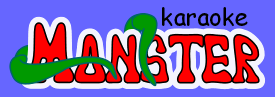

# The Karaoke Monster (college project in 2004)

In an innovative business competition in college in 2004, I designed and programmed the karaoke monster and won first prize amongst students.

It's old school crap code with a hilarious ASP and MSACCESS database, but maybe someone will take the idea and build a more modern app out of syncing lyrics.  Feel free to use the branding or anything out of it.

## Watch the video of me presenting to family on an old CRT monitor (Yes HD didnt exist back then)

  

## [The Deck](https://docs.google.com/presentation/d/1CWpgiDyyOa4kTY7x_Dn04d0BG8rYU77B1HCtEEP-pAw/edit?usp=sharing) Andy and I presented

Sadly we lost the recording of the live event because I was a nice guy and recorded someone else's presentation and I didnt have a plug in my handicam recorder and the battery died.

The database MSACCESS we had is long gone but you can take the idea and run with it and ressurrect the SQL calls necessary to render a modern app.

Please fork and delete everything and start from scratch!!
